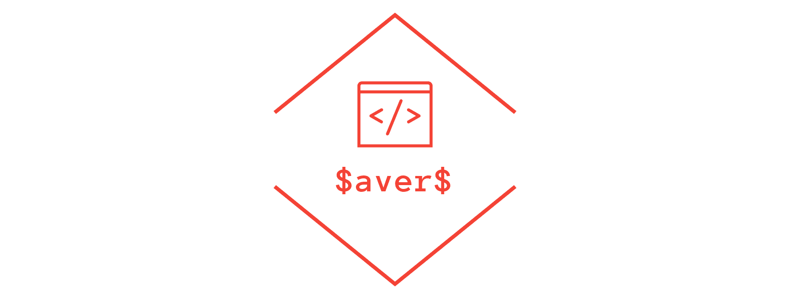

# Know How TO

# Co potrzebne do uruchomienia
* AWS CLI - [Zainstaluj AWS CLI ](https://docs.aws.amazon.com/cli/latest/userguide/cli-chap-install.html)
* SAM CLI - [Zainstaluj SAM CLI](https://docs.aws.amazon.com/serverless-application-model/latest/developerguide/serverless-sam-cli-install.html)
* Java8 - [Zainstaluj Java SE Development Kit 8](http://www.oracle.com/technetwork/java/javase/downloads/jdk8-downloads-2133151.html)
* Docker - [Zainstaluj Docker community edition](https://hub.docker.com/search/?type=edition&offering=community)
* Gradle - [Zainstaluj Gradle](https://gradle.org/install/)

## Jak zrobic to najmniej boleśnie i żeby działało :)
Uwaga nie biorę odpowiedzialności jeżeli jakiekolwiek inne narzędzie przestanie działać to jest mój prod setup na WIN

Instalujemy [chocolatey](https://chocolatey.org/install)

Następnie instalujemy JDK8, gradle i maven'a jak kto chce
```
choco install jdk8
choco install gradle
choco install maven
```
To zainstaluje nam wszystkie rzeczy od strony Javy potrzebnych do zbudowania aplikacji i ustawi odpowiednio `$PATH`

### Konfiguracja AWS CLI
Szybki [tutor](https://docs.aws.amazon.com/cli/latest/userguide/cli-chap-configure.html)
1. Zaloguj się na https://aws.amazon.com/education/awseducate/ za pomocą konta studenckiego
2. Wybierz `My Classroms`
3. Przejdź do klasy `Cloud Computing systems`
4. Wybierz `Account Details` i rozwiń opcję `AWS CLI`
5. Skopiuj wyświetloną zawartość do pliku `~/.aws/credentials`

Przykład:
```
[default]
aws_access_key_id=KeysEveryWhere
aws_secret_access_key=WhyYouWantToKnowThat
aws_session_token=SomethingVeryLong
```
6. Pod poleceniem `aws configure` powinny się wyświetlić prawidłowo dane

# Jak uruchomić aplikację SAM
Pamiętaj że musi być uruchomiony docker aby uruchomić aplikację
1. `sam build`
2. `sam local start-api`

# Jak uruchamiać pojedynczą lambdę
Za pomocą `sam local invoke`

```bash
sam local invoke HelloFunction --event events/event.json
```

Jezeli wszystko zrobione poprawnie powinno zwrócić taki json
```bash
{"body":"{ \"message\": \"hello world\", \"location\": \"ip-number\" }","headers":{"X-Custom-Header":"application/json","Content-Type":"application/json"},"statusCode":200} 
```
# Docker know-how
Do bazy mozemy korzystac z obrazu dynamodb dostępnego [tutaj](https://hub.docker.com/r/amazon/dynamodb-local)

* Pobieranie obrazów `docker pull {link do obrazu}`
* Listowanie kontenerów `docker ps -a` lub `docker container ls --all`
* Startowanie kontenerów `docker start dynamo`
* Zatrzymanie kontenera `docker stop dynamo`
* Usuwanie kontenera `docker container rm {nazwa/id kontenera}`
* Usuwanie wszystkich zatrzymanych kontenerów `docker container prune`


## Tworzenie kontenera
 `docker run -p 8000:8000 amazon/dynamodb-local`
 
 Opcja `-p ` powoduje zbindowanie portu kontenera 8000 na port hosta też 8000

`docker run -d --name "dynamo" -p 8000:8000 amazon/dynamodb-local`

## Dynamo
Po stworzeniu kontenera o nazwie dynamo możemy dostać się do shella bazy danych w przeglądarce wpisując
`localhost:8000/shell`

# Importowanie projektu
Nalezy clonowac z gita

`https://github.com/lodz-university-of-technology-masi/SaverS.git`

W IntelliJ zaimportować projekt i naciśnąć PPM `SaversAPI/build.gradle` i wybrać Import as Gradle Project

## Konfiguracje w IntelliJ
Należy mieć skonfigurowany [AWS Toolkit](https://docs.aws.amazon.com/toolkit-for-jetbrains/latest/userguide/welcome.html) i wybrany odpowiedni profil inaczej może się NIE ZBUDOWAĆ

Dla początkowej lambdy wybrać
* From template -> wybrać `template.yaml` a tam `Hello Function`
* Runtime `java8`
* Input, plik json `events/event.json`

Handler powinnien być w tym przypadku `saversapi.App::handleRequest`

### [Przykładowa restowa aplikacja](https://github.com/aws-samples/aws-sam-java-rest)


# AWS <Tak zwane ważne informacje>

This project contains source code and supporting files for a serverless application that you can deploy with the SAM CLI. It includes the following files and folders.

- SaversAPI/src/main - Code for the application's Lambda function.
- events - Invocation events that you can use to invoke the function.
- SaversAPI/src/test - Unit tests for the application code. 
- template.yaml - A template that defines the application's AWS resources. <- Muy importante

The application uses several AWS resources, including Lambda functions and an API Gateway API. These resources are defined in the `template.yaml` file in this project. You can update the template to add AWS resources through the same deployment process that updates your application code.

If you prefer to use an integrated development environment (IDE) to build and test your application, you can use the AWS Toolkit.  
The AWS Toolkit is an open source plug-in for popular IDEs that uses the SAM CLI to build and deploy serverless applications on AWS. The AWS Toolkit also adds a simplified step-through debugging experience for Lambda function code. See the following links to get started.

* [IntelliJ](https://docs.aws.amazon.com/toolkit-for-jetbrains/latest/userguide/welcome.html)
* [VS Code](https://docs.aws.amazon.com/toolkit-for-vscode/latest/userguide/welcome.html)


## Deploy the sample application

The Serverless Application Model Command Line Interface (SAM CLI) is an extension of the AWS CLI that adds functionality for building and testing Lambda applications. It uses Docker to run your functions in an Amazon Linux environment that matches Lambda. It can also emulate your application's build environment and API.

To use the SAM CLI, you need the following tools.

* AWS CLI - [Install the AWS CLI](https://docs.aws.amazon.com/cli/latest/userguide/cli-chap-install.html) and [configure it with your AWS credentials].
* SAM CLI - [Install the SAM CLI](https://docs.aws.amazon.com/serverless-application-model/latest/developerguide/serverless-sam-cli-install.html)
* Java8 - [Install the Java SE Development Kit 8](http://www.oracle.com/technetwork/java/javase/downloads/jdk8-downloads-2133151.html)
* Docker - [Install Docker community edition](https://hub.docker.com/search/?type=edition&offering=community)

The SAM CLI uses an Amazon S3 bucket to store your application's deployment artifacts. If you don't have a bucket suitable for this purpose, create one. Replace `BUCKET_NAME` in the commands in this section with a unique bucket name.

```bash
AWS$ aws s3 mb s3://BUCKET_NAME
```

To prepare the application for deployment, use the `sam package` command.

```bash
AWS$ sam package \
    --output-template-file packaged.yaml \
    --s3-bucket BUCKET_NAME
```

The SAM CLI creates deployment packages, uploads them to the S3 bucket, and creates a new version of the template that refers to the artifacts in the bucket. 

To deploy the application, use the `sam deploy` command.

```bash
AWS$ sam deploy \
    --template-file packaged.yaml \
    --stack-name AWS \
    --capabilities CAPABILITY_IAM
```

After deployment is complete you can run the following command to retrieve the API Gateway Endpoint URL:

```bash
AWS$ aws cloudformation describe-stacks \
    --stack-name AWS \
    --query 'Stacks[].Outputs[?OutputKey==`HelloWorldApi`]' \
    --output table
``` 

## Use the SAM CLI to build and test locally

Build your application with the `sam build` command.

```bash
AWS$ sam build
```

The SAM CLI installs dependencies defined in `SaversAPI/build.gradle`, creates a deployment package, and saves it in the `.aws-sam/build` folder.

Test a single function by invoking it directly with a test event. An event is a JSON document that represents the input that the function receives from the event source. Test events are included in the `events` folder in this project.

Run functions locally and invoke them with the `sam local invoke` command.

```bash
AWS$ sam local invoke HelloFunction --event events/event.json
```

Jezeli wszystko zrobione poprawnie powinno zwrócić taki json
```bash
{"body":"{ \"message\": \"hello world\", \"location\": \"ip-number\" }","headers":{"X-Custom-Header":"application/json","Content-Type":"application/json"},"statusCode":200} 
```


The SAM CLI can also emulate your application's API. Use the `sam local start-api` to run the API locally on port 3000.

```bash
AWS$ sam local start-api
AWS$ curl http://localhost:3000/
```

The SAM CLI reads the application template to determine the API's routes and the functions that they invoke. The `Events` property on each function's definition includes the route and method for each path.

```yaml
      Events:
        HelloWorld:
          Type: Api
          Properties:
            Path: /hello
            Method: get
```

## Add a resource to your application
The application template uses AWS Serverless Application Model (AWS SAM) to define application resources. AWS SAM is an extension of AWS CloudFormation with a simpler syntax for configuring common serverless application resources such as functions, triggers, and APIs. For resources not included in [the SAM specification](https://github.com/awslabs/serverless-application-model/blob/master/versions/2016-10-31.md), you can use standard [AWS CloudFormation](https://docs.aws.amazon.com/AWSCloudFormation/latest/UserGuide/aws-template-resource-type-ref.html) resource types.

## Fetch, tail, and filter Lambda function logs

To simplify troubleshooting, SAM CLI has a command called `sam logs`. `sam logs` lets you fetch logs generated by your deployed Lambda function from the command line. In addition to printing the logs on the terminal, this command has several nifty features to help you quickly find the bug.

`NOTE`: This command works for all AWS Lambda functions; not just the ones you deploy using SAM.

```bash
AWS$ sam logs -n HelloFunction --stack-name AWS --tail
```

You can find more information and examples about filtering Lambda function logs in the [SAM CLI Documentation](https://docs.aws.amazon.com/serverless-application-model/latest/developerguide/serverless-sam-cli-logging.html).

## Unit tests

Tests are defined in the `SaversAPI/src/test` folder in this project.

```bash
AWS$ cd SaversAPI
SaversAPI$ gradle test
```

## Cleanup

To delete the sample application and the bucket that you created, use the AWS CLI.

```bash
AWS$ aws cloudformation delete-stack --stack-name AWS
AWS$ aws s3 rb s3://BUCKET_NAME
```

## Resources

See the [AWS SAM developer guide](https://docs.aws.amazon.com/serverless-application-model/latest/developerguide/what-is-sam.html) for an introduction to SAM specification, the SAM CLI, and serverless application concepts.

Next, you can use AWS Serverless Application Repository to deploy ready to use Apps that go beyond hello world samples and learn how authors developed their applications: [AWS Serverless Application Repository main page](https://aws.amazon.com/serverless/serverlessrepo/)
